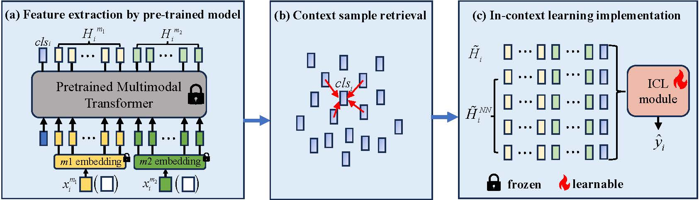
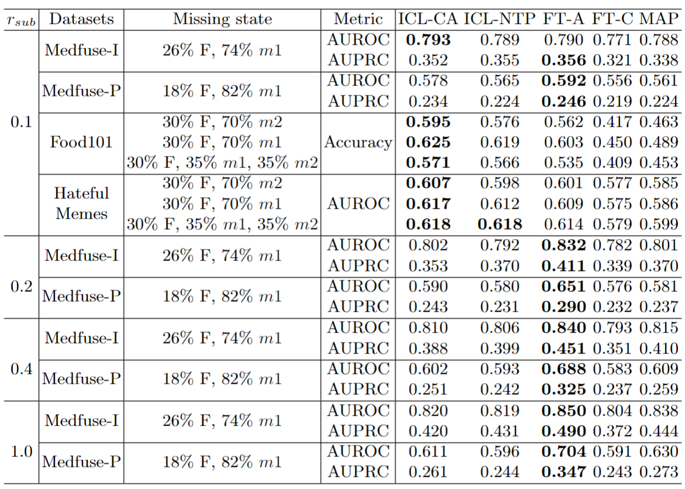

## Code for [ICL_multimodal](https://arxiv.org/abs/2403.09428): Borrowing Treasures from Neighbors: In-Context Learning for Multimodal Learning with Missing Modalities and Data Scarcity

Table of contents
=================

<!--ts-->
  * [Background](#Background)
  * [Overview](#Overview)
  * [Environment setup](#Environment-setup)
  * [Dataset](#Dataset)
  * [Model training](#Model-training)
  * [Model evaluation](#Model-evaluation)
  * [Citation](#Citation)
   
<!--te-->

Abstract
============
Multimodal machine learning with missing modalities is an increasingly relevant challenge arising in various applications such as healthcare. This paper extends the current research into missing modalities to the low-data regime, i.e., a downstream task has both missing modalities and limited sample size issues. This problem setting is particularly challenging and also practical as it is often expensive to get full-modality data and sufficient annotated training samples. We propose to use retrieval-augmented in-context learning to address these two crucial issues by unleashing the potential of a transformer's in-context learning ability. Diverging from existing methods, which primarily belong to the parametric paradigm and often require sufficient training samples, our work exploits the value of the available full-modality data, offering a novel perspective on resolving the challenge. The proposed data-dependent framework exhibits a higher degree of sample efficiency and is empirically demonstrated to enhance the classification model's performance on both full- and missing-modality data in the low-data regime across various multimodal learning tasks. When only 1% of the training data are available, our proposed method demonstrates an average improvement of 6.1% over a recent strong baseline across various datasets and missing states. Notably, our method also reduces the performance gap between full-modality and missing-modality data compared with the baseline.

Overview of the proposed method
====================================


The overview of the proposed method. **(a)** Assuming that each sample contains data with 2 modalities $x_i^{m_1}$ and $x_i^{m_2}$, we get the feature $H_i = ({H_i}^{m_1},{H_i}^{m_2},cls_i)$ of the sample by using a pre-trained multimodal transformer, note that $x_i^{m_1}$ or $x_i^{m_2}$ may be missed. **(b)** We use the $cls$ token to calculate the cosine similarity between the current sample and all full-modality training samples, and then retrieve the most similar $Q$ samples. **(c)** We input the pooled feature of the current sample  $\tilde{H}_i$ and neighbor samples $\tilde{H}^{NN}_i$ into the ICL module to predict the label ${\hat{y}}_i$. Note that only the ICL module requires to be trained and the others are frozen. The retrieval-augmented operation is the same for both the training and inference processes. Note that the words ‘missing modality' and 'incomplete modality', 'full modality' and 'complete modality' are used interchangeably.

Experimental Setup
====================================
Our experimental framework and environment configuration are based on [missing aware prompts](https://github.com/YiLunLee/missing_aware_prompts). Please check for details. We use four datasets for evaluation. 
* MedFuse-I (check [Medfuse](https://github.com/nyuad-cai/MedFuse) for details)
* MedFuse-P (check [Medfuse](https://github.com/nyuad-cai/MedFuse) for details)
* UPMC Food-101 (check [missing aware prompts](https://github.com/YiLunLee/missing_aware_prompts) for details)
* Hateful Memes (check [missing aware prompts](https://github.com/YiLunLee/missing_aware_prompts) for details)

Main code
====================================
See [Main_code](Main_code/Main_code.py) for the implementation details of different ICL modules. 

Special remarks
====================================
* The code is based on Pytorch-lightning, to ensure the reproducibility of the experimental results, consider the following:
    - set the global seed by 
   ```
   pl.seed_everything(seed)
   ```
    - modify algorithms without deterministic operations from
   ```
   torch.nn.functional.interpolate(x, scale_factor = scale_factor, mode='bilinear', align_corners = True)
   ```

    to
  
   ```
   torch.nn.functional.interpolate(x, scale_factor = scale_factor)
   ```
* Duplicate samples in Medfuse-I and Medfuse-P datasets. See [issues](https://github.com/nyuad-cai/MedFuse/issues/12#issue-1843420799) for the solution.
* 0 sample error in val and test dataset of Medfuse-I and Medfuse-P datasets. See [issues](https://github.com/nyuad-cai/MedFuse/issues/10#issue-1764373055) for the solution. 


Evaluation results
============
The evaluated results for all datasets under various missing cases and sample sizes are shown in the following tables. Bold number indicates the best performance. With sufficient target dataset size (notably for $r_{sub} > 0.1$), FT-A exhibits superior performance, attributed to the update of all parameters in the target domain. MAP follows closely, achieving competitive results by updating fewer parameters. FT-C, on the other hand, performs the worst at all moments, due to the limited number of updated parameters. When the target data is limited, our proposed ICL method, particularly ICL-CA, demonstrates remarkable efficacy (especially for $r_{sub} < 0.1$), surpassing most baseline approaches. This trend intensifies as $r_{sub}$ decreases.




  
Citation 
============
If you use this code for your research, please consider citing:

```
@article{zhi2024borrowing,
  title={Borrowing Treasures from Neighbors: In-Context Learning for Multimodal Learning with Missing Modalities and Data Scarcity},
  author={Zhi, Zhuo and Liu, Ziquan and Elbadawi, Moe and Daneshmend, Adam and Orlu, Mine and Basit, Abdul and Demosthenous, Andreas and Rodrigues, Miguel},
  journal={arXiv preprint arXiv:2403.09428},
  year={2024}
}
```
